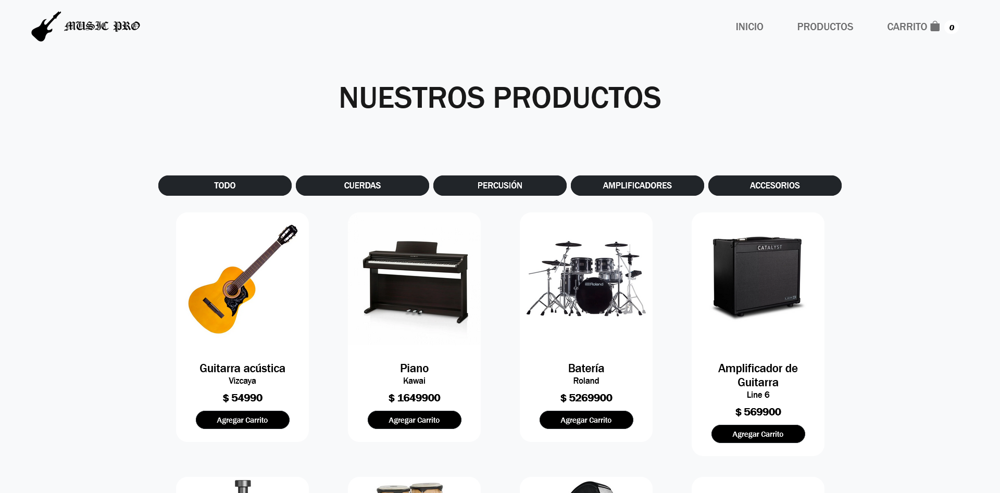

# 🎵 Music Pro

**Music Pro** es una página web dedicada a la compra de instrumentos musicales. Este proyecto fue desarrollado como parte de una actividad académica en colaboración con mis compañeros.

## 🛒 ¿Qué ofrece Music Pro?

Una interfaz sencilla y atractiva para explorar y adquirir distintos instrumentos musicales. La página está diseñada con HTML y CSS, enfocándose en la experiencia del usuario.

## 🚀 Cómo visualizar el proyecto

Para ver el sitio web en funcionamiento, solo necesitas:

1. Descargar o clonar el repositorio.
2. Abrir el archivo `tienda.html` en tu navegador web favorito (Google Chrome, Firefox, etc.).

## 🤝 Colaboradores

Proyecto realizado en conjunto con:

- **Armando Neira**

## 📸 Capturas del sitio

A continuación se muestran algunas vistas del diseño de la página:

